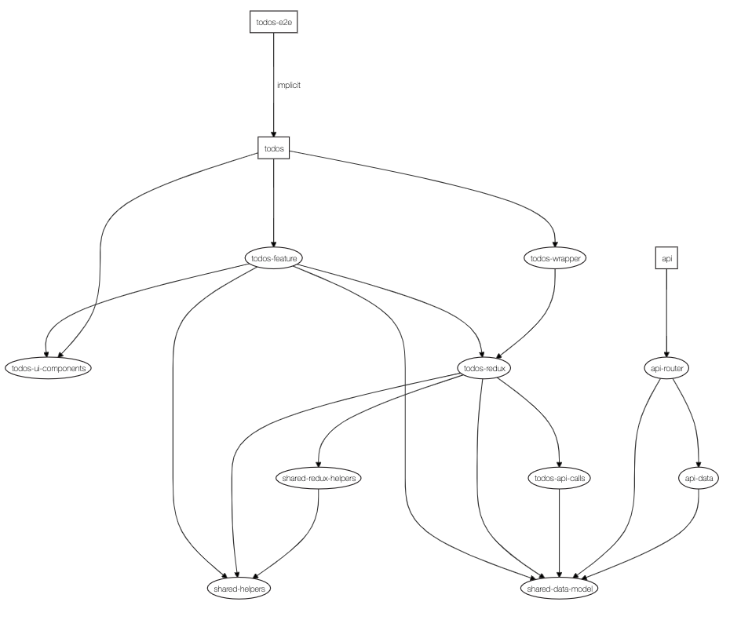

# NxTodos

ToDos project example

This project was generated using [Nx](https://nx.dev) ([v12.3.6](https://github.com/nrwl/nx/releases/tag/12.3.6))

- ToDos examples

  - [How To Build a React To-Do App with React Hooks | DigitalOcean](https://www.digitalocean.com/community/tutorials/how-to-build-a-react-to-do-app-with-react-hooks)

  - [Build a To-Do application Using Django and React | Scotch.io](https://scotch.io/tutorials/build-a-to-do-application-using-django-and-react)

ℹ️&nbsp;&nbsp;use the node.js v12 LTS

## Goal

- test a monorepository structure in a more entreprise scenario

## Documentation

- [Nx](docs/nx.md)

- [Project creation commands (steps)](docs/project-creation-commands.md)

## Project dependencies graph



## Findings

- Developing a project which contains an api and a frontend application, you need to have two terminals to run each project, for example, in one terminal you run `nx serve api` and in another one, you run `nx serve frontend`

- It's really interesting breakdown the application into
  smaller libs, so we have better code isolation, the possibility to run tests on that code and also using the `nx dep-graph` have a better understanding of the project code and how the parts of the project relate to each other

  - followed some ideas from [Using Nx at Enterprises](https://nx.dev/react/guides/monorepo-nx-enterprise)

- The libraries created by the Nx CLI has a pre-defined code structure ([more information about it here](https://nx.dev/react/tutorial/08-create-libs))

  - The main concept of a library adopted is to be a "Black Box", which what's exposed from the library is defined on the `src/index.ts`

  - It's possible to have more flexibility and expose the whole content from the library (that's really useful to define a UI components library). To do that, you need to reorganize the `src/` folder in the what that you want to access and change the `{project_root_folder}/tsconfig.json` the `paths` configuration alias to be something like

```
{
  ...
  "paths": {
    ...
    "@namespace/ui-components/*": ["libs/ui-components/src/*"]
    ...
  }
  ...
}
```

- When you run the build Nx CLI command, for example, `nx build app-name` that will generate the output of the build on the directory `dist/app/app-name`

- Running the frontend and backend together, based on the following [tweet](https://twitter.com/juristr/status/1290398409283850243)

  - `nx run-many --target=serve --projects=todos,api --parallel=true`
